# Vortex Operation Flowcharts

Visual companions to the Vortex runtime docs in this folder. Each diagram traces one operation end
to end, using the real function, file, state-path, and event names from the corresponding prose
doc. The diagrams are a map, not a substitute — the prose docs carry the detail, the gotchas, and
the tables.

Diagrams are Mermaid, which renders natively on GitHub and in most Markdown viewers.

## Contents

| Diagram | Source doc |
| --- | --- |
| [1. Mod install pipeline](#1-mod-install-pipeline) | `VORTEX_MOD_INSTALL.md` |
| [2. Mod update / version check](#2-mod-update--version-check) | `VORTEX_NEXUS_INTEGRATION.md`, `NEXUS_FILE_PROPERTIES.md` |
| [3. Load order handling (FBLO)](#3-load-order-handling-fblo) | `VORTEX_LOAD_ORDER.md` |
| [4. Deployment and purge](#4-deployment-and-purge) | `VORTEX_DEPLOYMENT.md` |
| [5. Game discovery and activation](#5-game-discovery-and-activation) | `VORTEX_GAME_LIFECYCLE.md` |
| [6. Profile switch](#6-profile-switch) | `VORTEX_PROFILES.md` |
| [7. Extension loading and init](#7-extension-loading-and-init) | `VORTEX_EXTENSION_LOADING.md` |

## How to read these

- **Solid arrows** are the main path; **dotted arrows** are notes, warnings, or side effects.
- Diamonds are decision points — the branch labels are the actual conditions the code tests.
- Names in nodes are literal identifiers. Grep them in the Vortex source or in the source doc.
- State paths are written with dots (`persistent.mods.gameId.modId`) rather than bracket
  subscripts, purely so every Mermaid renderer parses them.

## 1. Mod install pipeline

Turning a downloaded archive into an installed mod in the staging folder. Installed is **not**
deployed — see [diagram 4](#4-deployment-and-purge).

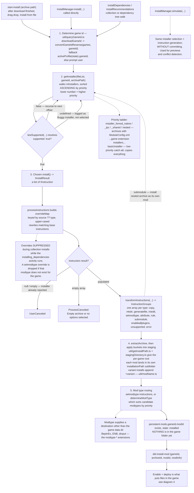

Collection installs additionally run phased:

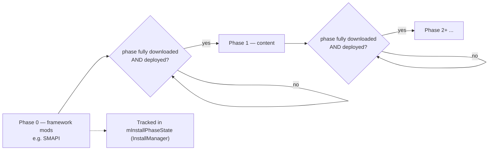

**Key branch points**

- Installer selection is *first match wins* on an ascending-priority list, so a low number
  pre-empts everything below it.
- A `testSupported` returning `undefined` is a bug — it is logged and the installer is skipped.
- Override instructions are intentionally disabled inside collection installs.

Detail: `VORTEX_MOD_INSTALL.md`. Authoring contracts: `INSTALLER_SYSTEM.md`, `FOMOD_INSTALLER.md`.
Phasing: `COLLECTIONS_FEATURE.md`.

## 2. Mod update / version check

How Vortex learns a managed mod has a newer file, and what happens when the user acts on it.

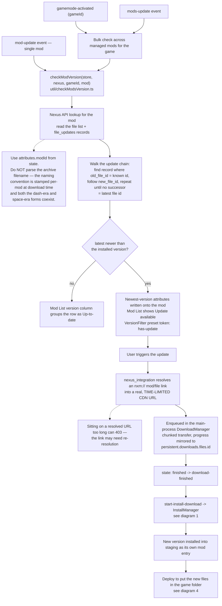

**Key branch points**

- The version check runs automatically on `gamemode-activated`, so simply activating a game kicks
  a round of update checks.
- The update chain is walked, not read as a single "latest" field — a mod with several superseded
  files resolves transitively through `old_file_id` -> `new_file_id`.
- An update is a full download-plus-install cycle; it reuses diagram 1 verbatim.

Detail: `VORTEX_NEXUS_INTEGRATION.md`, `NEXUS_FILE_PROPERTIES.md` (file update records, category
ids), `VORTEX_DOWNLOAD_MGMT.md` (the transfer), `VORTEX_MOD_LIST.md` (the version column and
filter).

## 3. Load order handling (FBLO)

The file-based load order system in the `file_based_loadorder` core extension. Gamebryo plugin
management is a **separate, parallel** system — see `GAMEBRYO_PLUGIN_SYSTEM.md`.

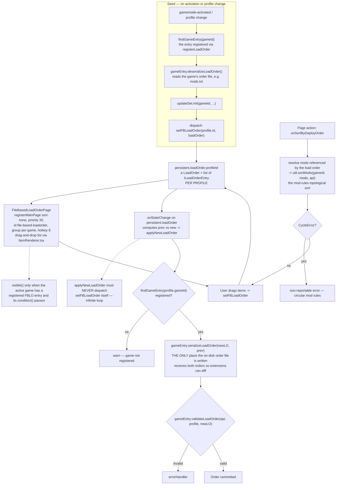

Re-sync around deployment:

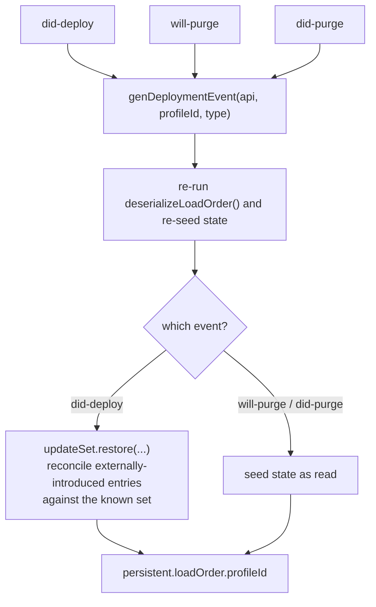

**Key branch points**

- Reorders flow *through Redux*: the UI writes state, and a state watcher — not the UI — performs
  serialization and validation.
- `serializeLoadOrder` is the single write point for the on-disk order file.
- `UpdateSet` exists because the order file can gain or lose entries outside the page (a mod added
  elsewhere); `restore` merges those in predictably after a deploy.

Detail: `VORTEX_LOAD_ORDER.md`. Authoring: `LOAD_ORDER_REGISTRATION.md`,
`LOAD_ORDER_ITEM_RENDERER.md`. Collections capture: `COLLECTIONS_FEATURE.md`.

## 4. Deployment and purge

Making staged mods present in the game folder, and removing them again.

```mermaid
flowchart TD
    TR["Triggers:<br/>mods-enabled / mod-enabled (debounced)<br/>gamemode-activated<br/>profile switch<br/>manual deploy"] --> LOCK["Acquire the ACTIVATION LOCK<br/>two deployments can never overlap"]

    LOCK --> S1["1. Load the previous deployment manifest<br/>per modtype -> lastDeployment.typeId"]
    S1 --> S2["2. will-deploy (emitAndAwait)<br/>profileId, lastDeployment, deployOptions<br/>handlers may disable mods or adjust state"]
    S2 --> S3["3. RE-READ the profile<br/>a will-deploy handler may have changed enablement"]
    S3 --> S4["4. dealWithExternalChanges — util/externalChanges.ts<br/>files changed/added in the game folder outside Vortex,<br/>compared against the manifest, user asked how to reconcile"]
    S4 --> S5["5. checkIncompatibilities — warn on known-incompatible mods"]
    S5 --> S6["6. doSortMods — order mods by mod rules / load order<br/>so conflict winners are deterministic"]
    S6 --> S7["7. doMergeMods — run registerMerge producers,<br/>writing outputs into the merged folder"]
    S7 --> S8["8. validateDeploymentTarget + deployAllModTypes"]
    S8 --> DM["deployMods, once per modtype"]
    DM --> S9["9. Activation lock released"]
    S9 --> S10["10. did-deploy (emitAndAwait) + mods-did-deploy (emit)"]
    S10 --> S11["11. bakeSettings (game settings / INI)<br/>then setDeploymentNecessary(gameId, false)"]
```

`deployMods` per modtype — `mod_management/modActivation.ts`:

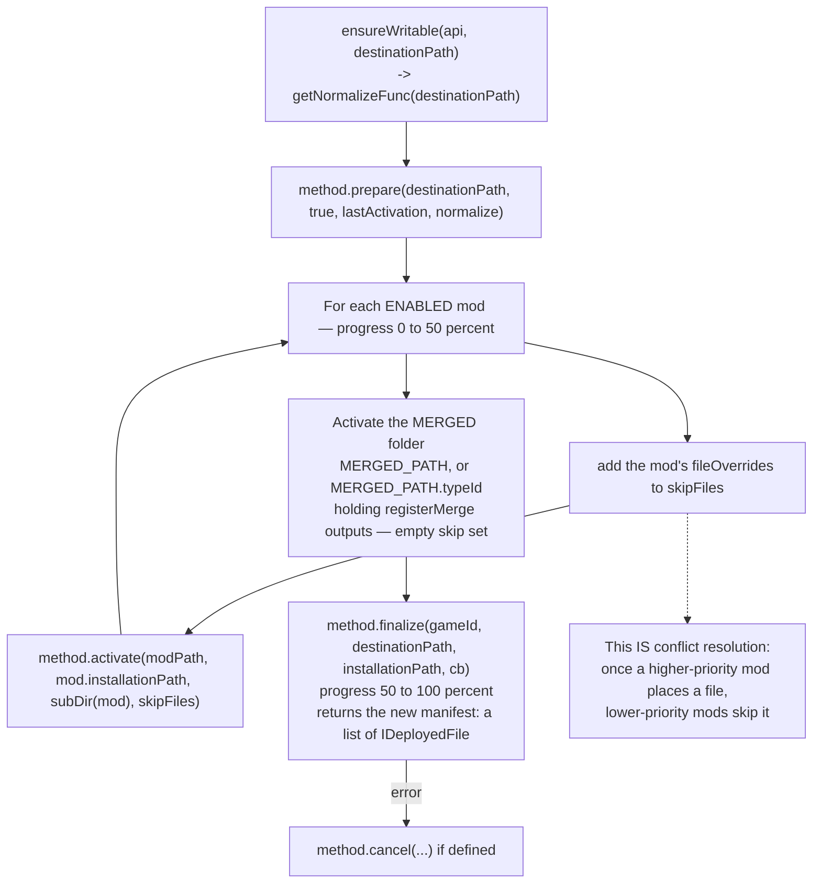

Choosing the activator:

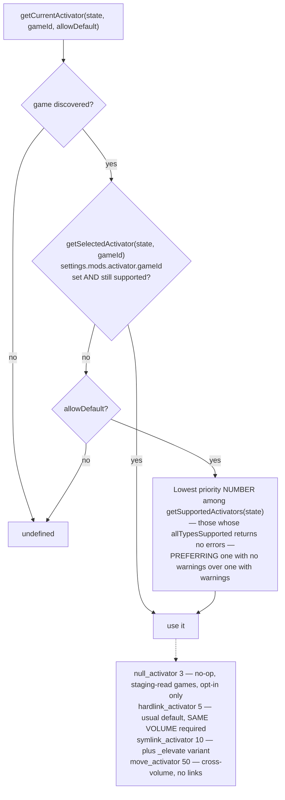

Purge:

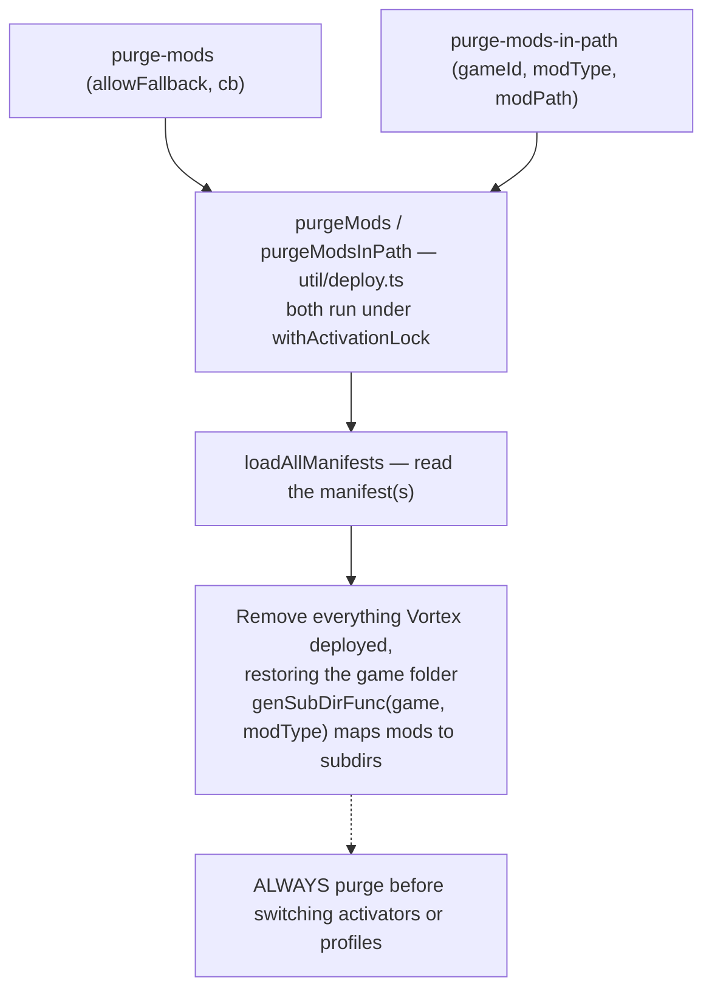

**Key branch points**

- Step 3 exists because step 2 can mutate state — skipping the re-read deploys a stale enabled set.
- The manifest is the source of truth for "what Vortex owns"; hand-editing the game folder shows up
  as an external change at step 4.
- `null_activator` has the lowest priority number but only reports supported for opt-in games, so
  it does not pre-empt hardlink in normal cases.

Detail: `VORTEX_DEPLOYMENT.md`. Authoring: `DEPLOYMENT_MANIFEST.md`, `REGISTER_MERGE.md`.

## 5. Game discovery and activation

Two separate things: finding the game on disk, and making it the actively managed game.

Discovery — `gamemode_management/util/discovery.ts`:

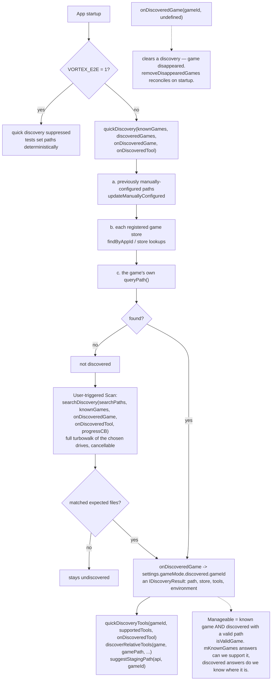

Activation — driven by the **active profile**, not selected directly:

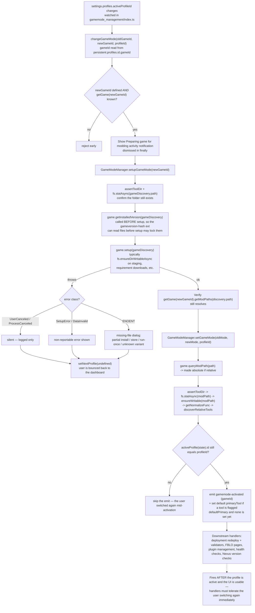

**Key branch points**

- `getInstalledVersion` deliberately runs *before* `setup`.
- The profile can change again mid-activation, so `setGameMode` re-checks before emitting.
- Any activation failure ends in `setNextProfile(undefined)` — "Vortex bounced me back to the
  dashboard" traces to exactly this.

Detail: `VORTEX_GAME_LIFECYCLE.md`. Authoring: `REGISTER_GAME.md`, `REQUIRES_LAUNCHER.md`,
`RUN_EXECUTABLE.md`.

## 6. Profile switch

A profile owns which mods are enabled (`modState`), the load order, and Gamebryo plugin state — so
switching profiles changes what deploys.

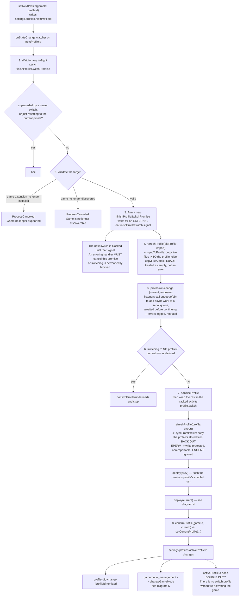

**Key branch points**

- `nextProfileId` is the *request*, `activeProfileId` is the *fact* — two separate state paths.
- The switch is cancellable: another `nextProfileId` change mid-flight makes the older switch bail.
- Both the outgoing and incoming profile deploy, in that order.

Detail: `VORTEX_PROFILES.md`. Profile features: `SETTINGS_REDUCER.md`.

## 7. Extension loading and init

Why nothing you write in `init(context)` actually runs when you write it.

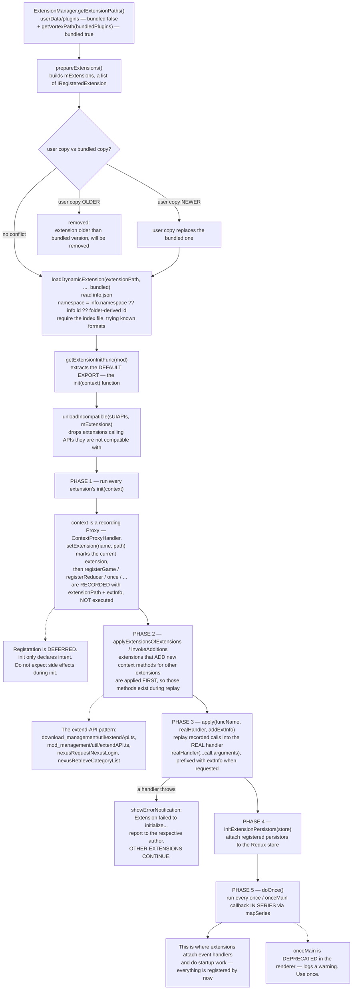

**Key branch points**

- The recording Proxy is the whole design: `init` declares, the manager replays.
- API-extending extensions apply before the general replay, which is why downstream extensions can
  call their added methods.
- Failures are isolated per extension at every phase.

Detail: `VORTEX_EXTENSION_LOADING.md`. Event handlers in `once`: `VORTEX_EVENT_BUS.md`.

## See also

Runtime docs these diagrams derive from: `VORTEX_MOD_INSTALL.md`, `VORTEX_DEPLOYMENT.md`,
`VORTEX_LOAD_ORDER.md`, `VORTEX_PROFILES.md`, `VORTEX_GAME_LIFECYCLE.md`,
`VORTEX_EXTENSION_LOADING.md`, `VORTEX_NEXUS_INTEGRATION.md`, `VORTEX_DOWNLOAD_MGMT.md`,
`VORTEX_EVENT_BUS.md`, `VORTEX_MOD_LIST.md`. Overview: `VORTEX_APP.md`.
