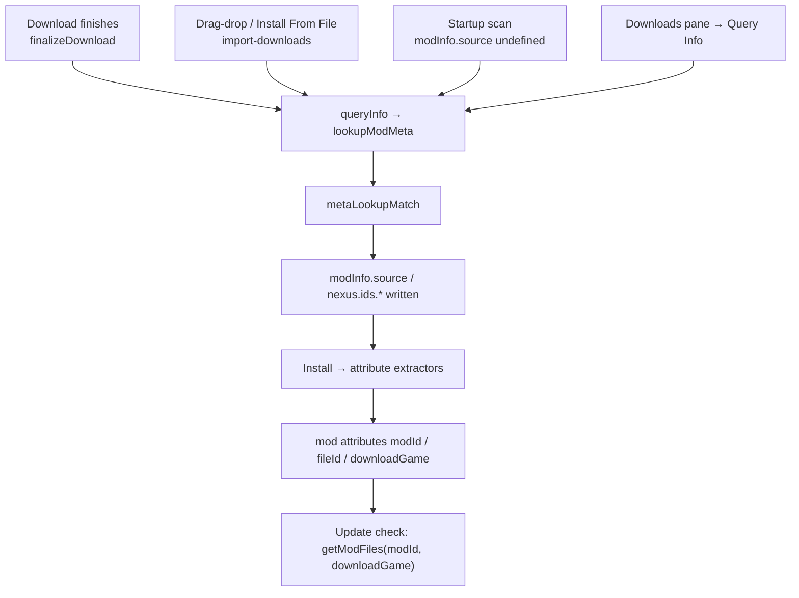

# Vortex Mod Metadata Assignment (runtime)

How Vortex decides that an archive on disk "is" a particular Nexus Mods mod — the MD5 meta lookup,
the tie-break rules, the attribute extractors, and the places where a file that never came from
Nexus ends up tagged with a Nexus `modId`/`fileId`.

This matters to extension authors because a wrong `modId` is not cosmetic: the update checker
consumes `modId` + `downloadGame` and will offer, and on request download, the "newer" file from
whatever mod page those two values point at.

> **Disambiguation.** The meta database is the npm package `modmeta-db` — a local LevelDB cache in
> front of remote _metadata servers_. It has nothing to do with **ModDB.com**, the mod hosting
> site covered in `MODDB_API.md`.

---

## Where metadata lives

Two separate stores, filled at different times, by different code:

| Store          | State path                                  | Filled by                              | Survives                     |
| -------------- | ------------------------------------------- | -------------------------------------- | ---------------------------- |
| Download meta  | `persistent.downloads.files[dlId].modInfo`  | download finalize, import, retro-scans | until the archive is deleted |
| Mod attributes | `persistent.mods[gameId][modId].attributes` | install (attribute extractors)         | until the mod is removed     |

The download store is the upstream one. Mod attributes are derived from it at install time, so a
bad `modInfo` becomes a bad set of mod attributes a few seconds later.

Keys that matter for the update checker:

- `modInfo.source` — `"nexus"`, `"unknown"`, or whatever an extension set
- `modInfo.nexus.ids.modId` / `.fileId` / `.gameId`
- `modInfo.meta` — the whole `IModInfo` record returned by the meta lookup
- `attributes.modId`, `attributes.fileId`, `attributes.downloadGame`, `attributes.source`

---

## The meta lookup

`api.lookupModMeta(details, ignoreCache?)` is the single entry point. It is implemented in
`ExtensionManager` and delegates to `modmeta-db`'s `ModDB.lookup(filePath, fileMD5, fileSize, gameId)`.

Behaviour worth knowing:

1. **MD5 is the only real key.** If `fileMD5` is absent, the file is hashed first. `fileName` and
   `gameId` never _select_ a result — they only sort and filter results that MD5 already produced.
2. **Local cache first.** Results are keyed `hash:<md5>:<size>:<gameId>:` in a LevelDB under
   `userData/metadb`, filtered by game, and honoured until expiry.
3. **Then remote servers,** in priority order. Vortex registers exactly one by default: the Nexus
   meta server, added by the `nexus_integration` extension as `nexus_api`. Users can add more under
   Settings → Download → Metaserver.
4. **The Nexus query is game-agnostic.** MD5 requests are debounced into a batch and sent as the
   `fileHashes(md5s: [...])` GraphQL v2 query. That query searches **every game domain on Nexus**.
   The `gameId` passed to `lookupModMeta` is _not_ forwarded — it is only used afterwards, to label
   the cache key and to break ties.
5. **Stale-but-expired results are reused.** If the remote returns nothing, `getAllByKey` falls
   back to the expired local entries rather than to "no match".
6. **Results are cached in-process too.** `ExtensionManager` memoises by
   `<md5>_<basename>_<size>_<gameId>`; only `ignoreCache: true` bypasses it.

A Nexus hit is translated into an `IModInfo` whose `sourceURI` is an `nxm://` URL built from the
**hosting domain**, e.g. `nxm://megastoresimulator/mods/7/files/8`.

---

## Which result wins

MD5 collisions are routine, because the same upstream archive is re-uploaded to many game domains
by many authors. `metaLookupMatch` picks one, in this order:

1. Drop results whose `status` is `revoked` or `unpublished`.
2. Prefer an exact `fileName` match against the archive on disk.
3. Otherwise prefer a result whose `gameId` equals the managed game.
4. Otherwise **take the first result** — literally `filtered[0]`, ordered by a sorter that prefers
   entries with a filename match, then `source === "nexus"`, then a non-empty `sourceURI`,
   `gameId`, `fileVersion`, `logicalFileName`, then whichever record has more `details` keys.

Step 4 is unconditional. There is no confidence threshold and no "give up" branch — if MD5 matched
anything at all, something is assigned.

Nexus filenames carry an id/timestamp suffix (`Configuration Manager-7-18-4-1-1770228238.zip`), so
an archive downloaded straight from a project's GitHub releases page can never satisfy step 2, and
a dependency hosted for a different game can never satisfy step 3. Such files always land on
step 4.

---

## Entry points that assign metadata



Detail per path:

- **Fresh download.** `finalizeDownload` hashes the file, dispatches `finishDownload`, then calls
  `queryInfo` for that id. This runs for **every** finished download regardless of where it came
  from, and regardless of any `modInfo` an extension supplied. The only skip is a missing MD5 or a
  zero-byte file.
- **Drag-and-drop onto the window / Install From File / `import-downloads`.** The archive is
  registered as a download, then `did-import-downloads` fires `queryInfo` for it.
- **`Install From File` with copy-on-install disabled.** Takes a different route — it installs
  first and then calls `lookupModMeta` itself, writing `source`/`modId`/`fileId`/`downloadGame`
  straight onto the finished mod.
- **Startup backfill.** `checkDownloadsWithMissingMeta` queries every download whose
  `modInfo.source` is undefined. `checkModsWithMissingMeta` copies `nexus.ids.*` from the download
  onto any installed mod that is `source: nexus` but missing ids.
- **A separate, weaker state-change hook** in `download_management` fires for downloads added with
  an entirely empty `modInfo` and writes `result[0].value` into `modInfo.meta` — bypassing
  `metaLookupMatch` and its revoked/unpublished filter altogether.
- **Manual repair.** The Downloads/Mods "Query Info" action re-runs the lookup with
  `ignoreCache: true`. The "Fix IDs" flow additionally guesses an id straight out of the filename
  with the regex `/-([0-9]+)-/` — that is the Nexus filename convention, so it should not be
  pointed at third-party filenames.

### What `queryInfo` writes

On a match it dispatches `meta`, then — if `sourceURI` parses as an `nxm://` URL —
`source: "nexus"`, `nexus.ids.gameId`, `nexus.ids.fileId`, `nexus.ids.modId`.

`meta` is written **before** any of the guards below, so a download can end up carrying a foreign
`meta` blob (and therefore a foreign `meta.domainName`) even when every guard correctly refused the
matching ids. Anything reading `meta.domainName` back later has to account for that.

The single guard is: _if the download already has a `nexus.ids.fileId` and it differs from the
looked-up one, discard everything._ That protects real Nexus downloads from a bad server response.
It does **not** protect a GitHub download, which has no `fileId` to compare against — so an
extension-supplied `modInfo` with `source: "website"` or a custom value is overwritten with
`source: "nexus"`.

### Which `nexus.ids` an nxm download actually carries

Not every Nexus download gets the same id shape, and the difference decides whether the guard above
can fire at all:

| Route                                                                                                                                          | `nexus.ids` written                       |
| ---------------------------------------------------------------------------------------------------------------------------------------------- | ----------------------------------------- |
| `startDownloadMod` — clicking an nxm link, the `nexus-download` event                                                                          | `gameId` (the page id), `modId`, `fileId` |
| nxm-protocol resolve — `InstallManager.downloadURL`, which is how **collection members** and fuzzy-version `downloadMatching` deps are fetched | `modId`, `fileId` only — **no `gameId`**  |

So a collection's Nexus-hosted dependency has a trustworthy `modId`/`fileId` but no game stamped
alongside them. Its game lives only in the download's own `game` array. Code deriving a game for
those ids must not silently substitute `meta.domainName`: on an MD5 collision that domain belongs
to a different mod entirely, while the ids are still correct.

Finally, if the resolved domain differs from the download's game, `queryInfo` emits
`set-download-games` with `[metaGameId, gameId]`, which **moves the archive on disk** into the
other game's download folder and rewrites its compatible-games list.

---

## Install: from `modInfo` to mod attributes

`InstallManager` re-runs the lookup (`fileMD5` + `fileSize` + `installGameId`), applies
`metaLookupMatch` again, stores the winner as `fullInfo.meta`, and hands `fullInfo` to
`filterModInfo`, which runs every registered attribute extractor and merges the results.

The merge order is a common source of confusion:

| Priority | Extractor                    | Supplies (selected)                                                            |
| -------- | ---------------------------- | ------------------------------------------------------------------------------ |
| 150      | `mod_management` core        | `version`, `source` (from `meta.source`), `category`, `author`, `homepage`     |
| 100      | `download_management`        | `fileName`, `fileMD5`, `fileSize`, `source`, `downloadGame`, `logicalFileName` |
| 50       | `nexus_integration`          | `modId`, `fileId`, `modName`, `version`, `uploader`, `pictureUrl`, …           |
| 25       | `download_management` custom | anything under `modInfo.custom`                                                |
| 10       | `mod_management` upgrade     | `category`, `notes`, `icon`, `color` carried from a previous install           |

Extractors are sorted **descending** by priority and merged with `Object.assign` in that order, so
**the lowest priority number wins** any key collision. Nullish values are stripped before merging,
so an extractor never blanks a key another one filled.

Two consequences:

- `attributes.source` becomes `"nexus"` whenever `meta.source` is `"nexus"` — i.e. whenever the MD5
  matched anything on Nexus, whatever the actual download origin was.
- `attributes.modId` / `fileId` come from `modInfo.nexus.ids` if present, otherwise from
  `meta.details.modId` / `.fileId`. Either way they trace back to `metaLookupMatch`.
- `attributes.downloadGame` comes from the **download's** game array, not from the meta result's
  domain. The two can disagree.

---

## What consumes the result

`checkModVersion` is gated on one thing only:

```js
const nexusModId = parseInt(getSafe(mod.attributes, ["modId"], undefined), 10);
if (isNaN(nexusModId)) {
    return PromiseBB.resolve();
}
const gameId = getSafe(mod.attributes, ["downloadGame"], undefined) || gameMode;
return nexus.getModFiles(nexusModId, nexusGameId(game, fallBackGameId));
```

Inside `checkModVersion` there is no check that the stored `fileMD5` still matches anything on that
page, and no check that the mod page's files resemble what is installed. Whatever `getModFiles`
returns is written to `newestVersion` / `newestFileId`, which is what drives the update badge and
the "Update" action.

`checkModVersion` itself does not test `attributes.source`, but **its callers differ**, which
decides how much an extension-set `source` actually protects a mod:

- **Bulk path** — `checkModVersionsImpl` (the "Check for updates" toolbar action and the startup
  check) filters to `attributes.source === 'nexus'` _before_ calling through, so a mod stamped
  `website`/`other` is never version-checked in bulk.
- **Single-mod paths** — the Mods-table row action and the "Fix IDs" flow call `checkModVersion`
  directly, with no source filter. A non-Nexus mod that still carries a stray `modId` is checked
  here.

That is why clearing `attributes.modId` is the reliable kill switch and setting a non-Nexus
`attributes.source` is only a partial one.

---

## Known failure mode: third-party dependencies mapped to unrelated mods

A modding dependency pulled from its own GitHub releases (BepInEx, BepInEx ConfigurationManager,
MelonLoader, UE4SS, …) is byte-identical to copies that other authors have re-uploaded to Nexus for
their own games. The MD5 lookup finds those copies, and every filter above fails open.

Worked example, verified against the live Nexus GraphQL API:

`BepInEx.ConfigurationManager_BepInEx5_v18.4.1.zip` — MD5 `03494de0ee386cb47d0f160259036810`,
44,926 bytes — resolves to exactly one Nexus file:

| Field    | Value                 |
| -------- | --------------------- |
| domain   | `megastoresimulator`  |
| `modId`  | 7                     |
| `fileId` | 8                     |
| mod name | Configuration Manager |

Installed while managing Hollow Knight: Silksong, the mod ends up with `modId: 7`. If
`downloadGame` remains the managed game — which happens whenever the `set-download-games` move does
not take effect, e.g. because the extension starts installing the archive immediately after the
download finishes — the update check resolves to `hollowknightsilksong/mods/7`, which is
**"No-HUD-No-Effects"**, an unrelated mod. Accepting that update replaces the configuration manager
with files that have nothing to do with it.

`BepInEx_win_x64_5.4.23.3.zip` (MD5 `719d0f0834cd24d1c661b66054ca0294`) is worse: four Nexus hits
across four unrelated domains — `mytimeatsandrock/mods/129`, `lethalcompany/mods/261`,
`superhotvr/mods/3` (removed), `taintedgrailthefallofavalon/mods/50`. None is the managed game and
none matches the GitHub filename, so tie-break step 4 picks whichever the sorter happens to rank
first. Against Silksong, `modId: 129` maps to `hollowknightsilksong/mods/129`, "bell beast save
file".

The behaviour is therefore not random and not a server fault — it is the documented tie-break
ladder falling through to `filtered[0]`, combined with an update checker that trusts `modId`
without re-validating it.

### Fixed upstream

Reported as [Nexus-Mods/Vortex#21979](https://github.com/Nexus-Mods/Vortex/issues/21979) and fixed
by [PR #24195](https://github.com/Nexus-Mods/Vortex/pull/24195), merged 2026-09-16. The fix scopes
the md5 hit list to the domains the download's game actually belongs to **before** the ladder above
runs, so a re-uploaded copy on an unrelated game's page is never a candidate in the first place —
this is a fix at the lookup layer, not the consumer layer, so it protects every download
automatically, whether or not the extension that fetched it declares anything. The mitigations
below still hold and cost nothing extra; keep using them until every user is on a Vortex build that
carries this fix.

### Symptoms to look for

- A requirement/dependency mod shows a Nexus author, picture, or description it should not have.
- An "update available" badge on a mod the user never got from Nexus.
- The archive disappears from the current game's Downloads tab (moved by `set-download-games`).
- Vortex log lines `lookup mod meta info` / `metadata lookup completed` for a non-Nexus download.

### What an extension author can do

Nothing in the extension API blocks the lookup — it is unconditional on download finalize. Partial
mitigations:

- Set `attributes.source` to a non-Nexus value **after** install completes, and clear
  `attributes.modId` / `attributes.fileId`. `checkModVersion` bails on a non-numeric `modId`, so
  clearing `modId` is the effective kill switch for the bad update check.
- Clear those two with the **singular** `setModAttribute(gameId, modId, 'modId', undefined)`. The
  mods reducer routes an `undefined` value to `deleteOrNop` and actually removes the key; the
  plural `setModAttributes` merges its object in, and a merge can never delete.
- Use a **registered** source id. `mod_management` registers `user-generated`, `website` and
  `unsupported`, and `nexus_integration` adds `nexus`. Note that `unsupported` is the id whose
  display name is "Other" — `'other'` itself is not a registered id at all, and `getModSource`
  returns `undefined` for it, which leaves the mod list's Source column blank. `'website'` is the
  value core itself writes for a non-Nexus install.
- The **download** entry's `modInfo.source` shares that same id namespace, so the same rule
  applies there. The mod list's Source column proves it: its `onChangeValue` writes the selected
  id through `setDownloadModInfo` for a download row and `setModAttribute` for an installed one.
- **Declare it on the download _before_ starting the install.** `InstallManager` re-reads the
  download from live state immediately before running the attribute extractors ("refresh download
  data from current state"), so a value written at that moment is the one `processAttributes` sees
  — and `processAttributes` gates its whole Nexus fetch on `modInfo.source === 'nexus'`. Writing it
  after the install completes is too late to prevent any of that. Setting it also permanently
  exempts the download from the startup "downloads missing meta" sweep, which only re-queries
  entries whose `modInfo.source` is undefined.
- That write **races `queryInfo`**, which `finalizeDownload` fires without awaiting. On stock
  Vortex the md5 lookup usually completes after the declaration and stamps `'nexus'` back over it.
  It holds outright on an archive that was already downloaded (that lookup ran long ago), and it
  becomes authoritative on a Vortex whose `queryInfo` returns early when a download already
  declares a non-Nexus source.
- Clearing the ids is **not** always right. Where the md5 match is genuinely correct — the file
  really did come from the Nexus page the extension fetched it from — the resolved `modId`/`fileId`
  are the real ones and should be kept, and the download should stay Nexus-sourced so the install
  picks up the page's true author, picture and description. Stamping the mod `source: 'website'` is
  enough to keep Vortex's bulk update check off it, since that path filters on `source === 'nexus'`.
- Do not rely on passing `source` in the `start-download` `dlInfo` — `queryInfo` overwrites it.
- Prefer installing dependencies as their own mod type with a distinct name, so a mistaken update
  is at least visible in the mod list.

---

## See also

`VORTEX_DOWNLOAD_MGMT.md` (how the archive gets to `finalizeDownload` in the first place),
`VORTEX_MOD_INSTALL.md` (the install pipeline these attributes are written into),
`VORTEX_NEXUS_INTEGRATION.md` (the update-check runtime that consumes `modId`/`downloadGame`),
`NEXUS_MODS_API.md` and `NEXUS_FILE_PROPERTIES.md` (the `md5_search` / `fileHashes` endpoints and
the file objects they return), `DOWNLOADER.md` (the GitHub requirements downloader whose files hit
this path), `VORTEX_EVENT_BUS.md` (`set-download-games`, `did-import-downloads`).
**Not** `MODDB_API.md` — different "moddb".
`GITHUB_API.md` (where the GitHub-sourced archives that get mis-tagged come from).
`VORTEX_DATABASES.md` (the `metadb` store on disk, its `hash:<md5>:<size>:<gameId>:` key format,
and how to read a cached lookup back out).
